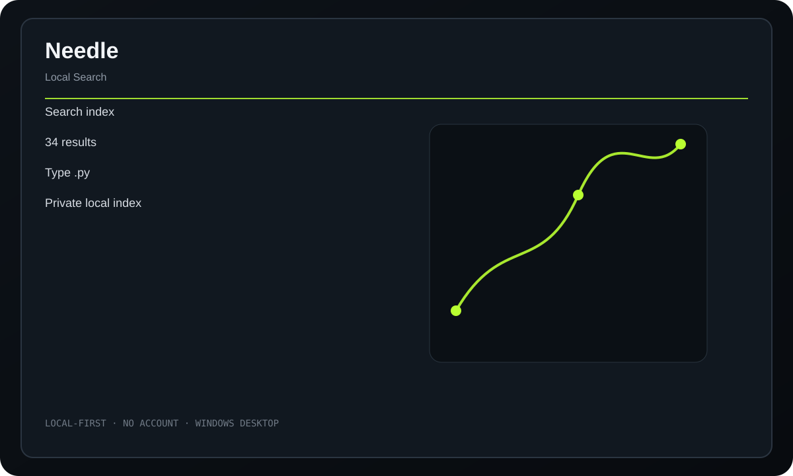

<div align="center">
  
  <h1>Needle</h1>
  <p><strong>A private local search engine for indexing, finding, browsing, and opening files on your computer.</strong></p>
  <p>
    <a href="https://github.com/purysho/Needle/actions/workflows/ci.yml"></a>
    <a href="https://github.com/purysho/Needle/releases"></a>
    <a href="LICENSE"></a>
  </p>
  <p><a href="https://github.com/purysho/Needle/releases"><strong>Download for Windows</strong></a> · <a href="#run-from-source">Run from source</a> · <a href="https://github.com/purysho/Needle/issues">Report an issue</a></p>
</div>



## What it does

- Build and update local file indexes
- Fast filename and content search
- Exact-phrase and typo-tolerant search
- Browse indexed files by extension
- Open or reveal results directly
- Portable local JSON indexes

## Download

Tagged releases are built on `windows-latest` by GitHub Actions. Each release contains `Needle.exe` and `Needle.exe.sha256`. The executable is produced from the source at that tag with PyInstaller.

> Until the first tagged release is published, the latest Windows build is available as the **Needle-windows** artifact on successful CI runs.

## Run from source

Requirements: Python 3.10+ with Tk support.

```powershell
pyw needle_desktop.pyw
```

The application uses Python's standard library at runtime.

## Build a standalone Windows executable

```powershell
powershell -ExecutionPolicy Bypass -File .\build-windows.ps1
```

Output:

```text
dist\Needle.exe
```

## Privacy

Index creation and searching happen locally. Needle does not need a hosted search service or account.

## Scope

Needle targets personal/local file discovery rather than enterprise document management. Search is deliberately lightweight and deterministic.

## Release process

- Every push runs tests/compile checks and builds a Windows executable artifact.
- Tags matching `v*` build the executable again, compute SHA256, and publish both files to GitHub Releases.
- See [CHANGELOG.md](CHANGELOG.md) for release history.

## License

MIT
